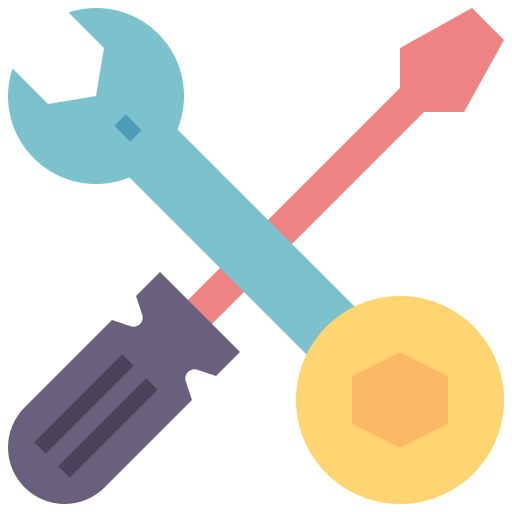
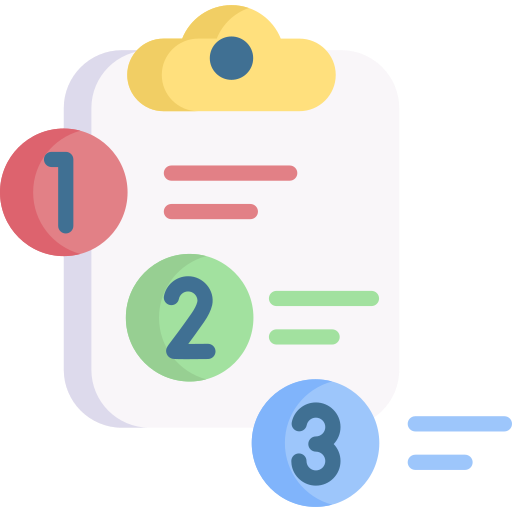
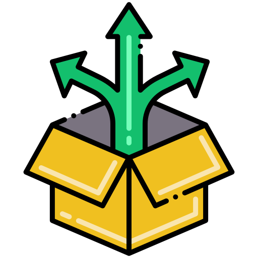

# blockchain-developer-bootcamp-final-project

<p align="center">
  <a href="https://blockchain-bootcamp.constantine.dev/">
    <picture>
      
    </picture>
    <h1 style="font-weight: bold" align="center">ConsenSys Academy Final Project - Crypto Lottery</h1>
	</a>
</p>

<p align="center">
	
	
	
	
</p>

A crypto lottery WEB3 [`turborepo`](https://turborepo.org/) using [`NextJS`](https://nextjs.org), [`TypeScript`](https://www.typescriptlang.org/), [`ReactJS`](https://reactjs.org/), [`TailwindCSS`](https://tailwindcss.com/), [`Solidity`](https://docs.soliditylang.org/en/v0.8.17/), [`Truffle`](https://trufflesuite.com/)  and [`ThirdWeb`](https://thirdweb.com/).

A Polygon (MATIC) based app where any user can log in with his MetaMask wallet and buy lottery tickets. The duration of the lottery is 30 minutes. The more tickets a user have the more chances he has to win the prize.

<!-- [//]: # (below line is for horizontal line DO NOT DELETE) -->
#

<details>
  <summary style="font-size: 1.7rem" id="tableOfContents">Sections</summary>
	<ul>
		<li><a href="#actions">Actions</a></li>
		<li><a href="#demo">Demo Link</a></li>
		<li><a href="#apps">Apps and Packages</a></li>
		<li><a href="#utilities">Utilities</a></li>
		<li><a href="#requirements">Prerequisites</a></li>
		<li><a href="#ui">Frontend</a></li>
		<ul>
			<li><a href="#docker">Docker</a></li>
		</ul>
		<li><a href="#contract">Contract</a></li>
		<li><a href="#test">Solidity Tests</a></li>
		<ul>
			<li><a href="#test-locally">Test locally with ganache</a></li>
			<li><a href="#test-matic">Test in polygon's mumbai testnet</a></li>
		</ul>
			<li><a href="#deploy-thirdweb">Deploy the smart contract in thirdweb</a></li>
			<li><a href="#deploy-docker">Deploy the frontend with Docker in a dedicated Server</a></li>
			<li><a href="#deploy-vercel">Deploy the frontend to Vercel</a></li>
			<li><a href="#releases">Releases</a></li>
			<li><a href="#deployments">Deployments</a></li>
			<li><a href="#public-address">Public Address</a></li>
	</ul>

</details>

<!-- [//]: # (below line is for horizontal line DO NOT DELETE) -->
#

##  Actions

#### ***`Buyer actions`***

```md
> Buy tickets.

> Withdraw winnings.

> Check winnings amount.
```

#### ***`Lottery bank actions`***

```md
> Refund all tickets before the lottery ends.

> Draw winner ticket.

> Withdraw commission.

> Restart lottery.

> Calculate current winning reward.

> Find the winner.

> Calculate remaining tickets.
```

<!-- [//]: # (below line is for horizontal line DO NOT DELETE) -->
#

<div align="center">

[](https://blockchain-bootcamp.constantine.dev/)

</div>


<!-- [//]: # (below line is for horizontal line DO NOT DELETE) -->
#

##  Apps and Packages

- `📁 crypto-lottery`: a [`Next.js`](https://nextjs.org) app for the ui
- `📁 crypto-lottery-contract`: a [`Solidity`](https://docs.soliditylang.org/en/v0.8.17/) app for the smart contract
- `📁 ui`: a stub [`React`](https://reactjs.org/) component library shared by the `crypto-lottery` app
- `📁 eslint-config-custom`: `eslint` configurations (includes `eslint-config-next` and `eslint-config-prettier`) used throughout the monorepo
- `📁 tsconfig`: `tsconfig.json`'s used throughout the monorepo
- `📁 tailwindcss-config`: `tailwind.config.js`'s used throughout the monorepo

##  Utilities

This turborepo has some additional tools already setup for you:

- [`TypeScript`](https://www.typescriptlang.org/) for static type checking.
- [`ESLint`](https://eslint.org/) for code linting.
- [`Prettier`](https://prettier.io) for code formatting.
- [`NextJS`](https://nextjs.org) for routing and Server Side Rendering.
- [`ReactJS`](https://reactjs.org/) for building the UI components.
- [`TailwindCSS`](https://tailwindcss.com/) for css styling.
- [`Solidity`](https://docs.soliditylang.org/en/v0.8.17/) for the smart contract.
- [`Truffle`](https://trufflesuite.com/) for the solidity tests.
- [`ThirdWeb`](https://thirdweb.com/) for releasing and deploying the smart contract.
- [`Docker`](https://www.docker.com/) for containerizing and running the app.

<!-- [//]: # (below line is for horizontal line DO NOT DELETE) -->
#

##  Prerequisites

Install these globally on your computer

- [`yarn ^1.22.5`](https://yarnpkg.com/)
- [`node.js v16.17.0`](https://nodejs.org/en/)

<!-- [//]: # (below line is for horizontal line DO NOT DELETE) -->
#

##  [`Frontend`](apps/crypto-lottery)

### Install Dependencies

```bash
yarn install or npm install
```

Create a .env.local file on the root of the apps/crypto-lottery app, based on the .env.example file

```bash
BROWSER=none
NEXT_TELEMETRY_DISABLED=1
NEXT_PUBLIC_LOTTERY_CONTRACT_ADDRESS=
```

### Build

To build all apps and packages, run the following command:

```bash
yarn run build
```

### Run app

To run all apps and packages (after building them), run the following command:

```bash
yarn run start
```

### Develop

To develop all apps and packages, run the following command:

```bash
yarn run dev
```

or using [`Docker`](https://www.docker.com/)

```bash
yarn docker:build:dev
```

and then

```bash
docker run --env-file ./apps/crypto-lottery/.env.local -it --rm -v ${PWD}/packages/ui:/app/packages/ui -v ${PWD}/apps/crypto-lottery:/app/apps/crypto-lottery -v /app/node_modules -v /app/.next -p 3000:3000 -e CHOKIDAR_USEPOLLING=true --name crypto-lottery-app crypto-lottery
```

##  Docker

To build a production ready docker image, run the following command:

```bash
yarn docker:build
```

To run a production ready docker image after building it, run the following command:

```bash
yarn docker:run
```

Then open your browser at [`http://localhost:1237`](http://localhost:1237).

To build and run a production ready docker image in the background, run the following command:

```bash
yarn docker:compose:up
```

To stop a production ready docker image from the background, run the following command:

```bash
yarn docker:compose:down
```

To open a bash terminal inside the running docker image, run the following command:

```bash
yarn docker:bash
```

<!-- [//]: # (below line is for horizontal line DO NOT DELETE) -->
#

##  [`Smart Contract`](apps/crypto-lottery-contract)

### Install Dependencies

```bash
cd apps/crypto-lottery-contract
yarn install or npm install
```

### Run locally with [`Ganache`](https://trufflesuite.com/ganache/)

First start up ganache, by downloading it and running it on your computer or by installing the ganache-cli and running the following command

```bash
yarn ganache:start
```

After starting ganache, you will have a local blockchain running on your pc.

Run this command to deploy the contract migrations on the local blockchain __`(All migrations are written in Typescript and must end in .ts)`__

```bash
cd apps/crypto-lottery-contract
yarn truffle:migrate
```

Connect your metamask to the local network, by clicking on add network

```bash
Network Name = Localhost
New RPC URL = http://127.0.0.1:8545
Chain ID = 1337
Currency Symbol = ETH
```

Add a ganache account to access some funds

```bash
Copy a private key from a ganache account and click on MetaMask import account
```

<!-- [//]: # (below line is for horizontal line DO NOT DELETE) -->
#

##  Solidity Tests

The tests are located in `apps/crypto-lottery-contract/test`

__`All tests are written in Typescript and must end in .test.ts`__

###  Run locally in ganache chain


To run the tests start the ganache blockchain

```bash
yarn ganache:start
```

and execute the following command

```bash
yarn truffle:test
```

###  Run in Polygon's Mumbai Testnet

1. Create an account in the official [`Matic/Polygon Testnet`](https://rpc.maticvigil.com/).

2. Create an App from the dashboard.

3. Copy your MetaMask mnemonic and your app's Mumbai Testnet RPC URL and create a .env at (apps/crypto-lottery-contract) as the .env.example provided and fill in your values

```bash
MNEMONIC=
MATIC_RPC_ID=
```

`Note: For the value of MNEMONIC add without the quotes, ex: MNEMONIC=lorem ipsum dolor sit amet`

1. Add some matic to your account using the [`Polygon Faucets`](#deploy) below.

2. Run the following command:

```bash
yarn truffle:test-matic
```

<!-- [//]: # (below line is for horizontal line DO NOT DELETE) -->
#

##  Deploy the smart contract in [`Thirdweb`](https://thirdweb.com/)

```bash
cd apps/crypto-lottery-contract
npx thirdweb@latest release
```

1. Open the thirdweb link and check the Mumbai(MATIC) Testnet to release the contract.

2. Use these Polygon Faucets to obtain some money for the polygon testnet gas fees:

    - [`Polygon Faucets`](https://faucet.polygon.technology/)
    - [`Polygon Faucets`](https://mumbaifaucet.com)
    - [`Polygon Faucets`](https://stakely.io/en/faucet/polygon-matic)

3. After releasing and getting some money, click on Deploy Now and select Mumbai(MATIC) Testnet.

4. Copy the deployed Contract's address (below the contract's name), create a .env.local file as the .env.example file and paste the value in this variable:

```bash
NEXT_PUBLIC_LOTTERY_CONTRACT_ADDRESS=
```

##  Deploy the frontend with Docker in a dedicated Server

Create a .env.production.local file on the root of the apps/crypto-lottery app, based on the .env.example file

```bash
BROWSER=none
NEXT_TELEMETRY_DISABLED=1
NEXT_PUBLIC_LOTTERY_CONTRACT_ADDRESS=<ThirdWebDeployedAddress>
```

Run the following commands to build and run the docker image from the server's terminal

```bash
yarn docker:compose:build
yarn docker:compose:up
```

Navigate to http://localhost:1237 from the server or expose the 1237 server's port and go to http://<serverIp>:1237 from anywhere you want.

##  Deploy the frontend to [`Vercel`](https://vercel.com/)

1. Point the root directory to `apps/crypto-lottery`

2. Override the build command with:

```bash
cd ../.. && npx turbo run build --filter=crypto-lottery
```

3. Add the environment configs

```bash
NEXT_PUBLIC_LOTTERY_CONTRACT_ADDRESS=<ThirdWebDeployedAddress>
```

##  Releases

- [v1.0.0 (latest)](https://thirdweb.com/0x43E9a680aedc9Ad401C9E3e06D2C48EAE1D2B605/Lottery)

##  Deployments

- [v1.0.0 (latest)](https://thirdweb.com/mumbai/0x43E9a680aedc9Ad401C9E3e06D2C48EAE1D2B605/)

<!-- [//]: # (below line is for horizontal line DO NOT DELETE) -->
#

##  Public Address for verification

```bash
0x43E9a680aedc9Ad401C9E3e06D2C48EAE1D2B605
```

##### * Created as the final project of the [`ConsenSys blockchain developer bootcamp`](https://consensys.net/academy/bootcamp/)
